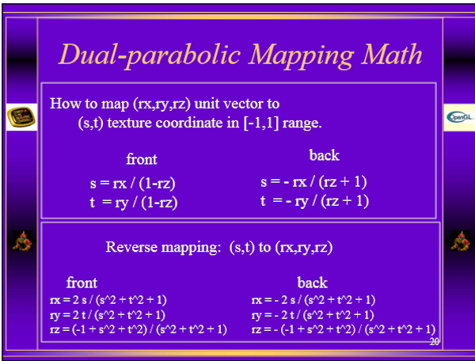
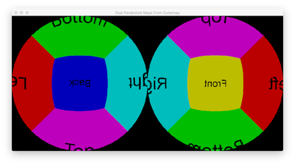
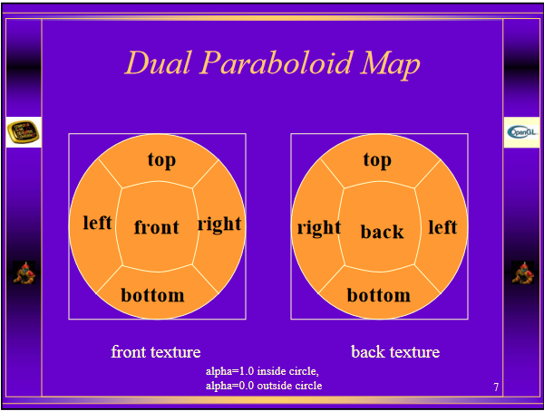
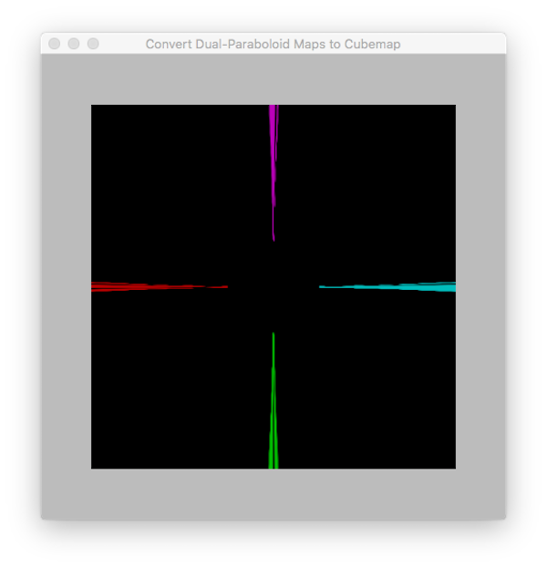
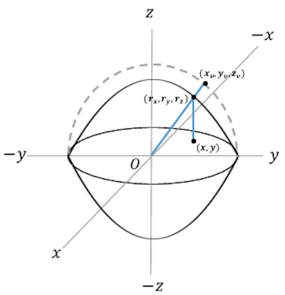
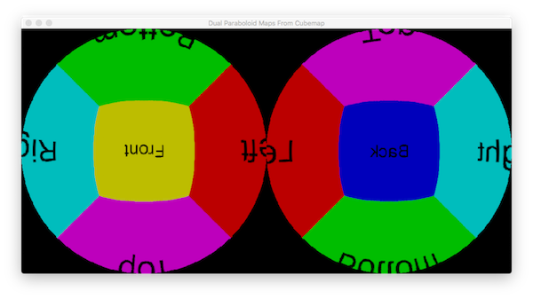
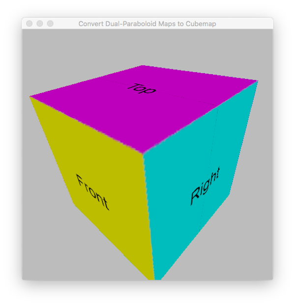
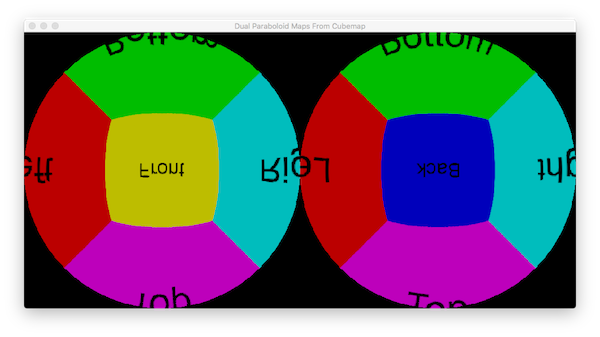
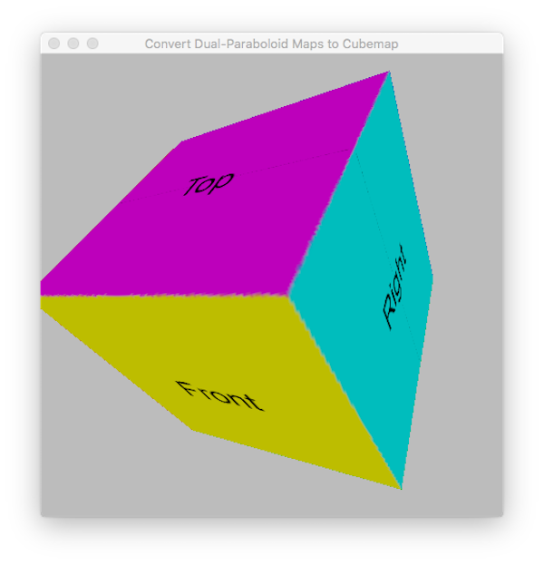

# Convert a cubemap to/from a dual-paraboloid map. 


## Overview

Environment maps are used to give objects reflective or refractive properties. Often the reflective or refractive object is at the centre of the scene. 

Three environment maps techniques had been developed over the past few decades. They are Sphere Mapping, Dual-Paraboloid Mapping and Cube Mapping.

Information of these techniques are usually on how to perform environment mapping with Sphere maps, dual-paraboloid maps and Cubemaps. 

This project attempts to generate a pair of dual-paraboloid textures from the six 2D textures of a cubemap texture. It also applies reverse operations to convert the generated dual-paraboloid map back to a cubemap.

## Outline of programs

This project consists of two programs: the first one is named **DPMapFromCubemap** and the second one **CubemapFromDPMap**. For both programs, the target texture(s) is/are rendered to an offscreen framebuffer object. The first program renders a dual-paraboloid map which consists of two 2D textures. The second program renders a cubemap (which are six 2D textures). Both programs used a separate vertex-fragment shader pair to display the rendered textures on the screen. (We will be compiling and executing the macOS version of both programs for testing purposes.)

The vertex shaders of both programs are very simple. All the work of mapping from one projection to another is done by the fragment shaders, **GenerateDPM.glsl** and **CubeFragmentShader.glsl**.


## Details

We will not be explaining the theory behind dual-paraboloid mapping. The reader can visit some of the weblinks listed below. Instead, we will be focussed on how to project a cubemap onto a dual-paraboloid map (which consists of two separate textures/images) and to reverse the mapping.



Refering to the slide (with the caption: Dual-parabolic Mapping Math) above (posted by NVidia), there are 2 sets of instructions showing how to map a 3D unit vector (rx, ry, rz) to a pair of texture coordinates (s, t) in the range [-1.0, 1.0].

It is not clear how the information can be applied. But one thing we do know is, in order to access the pixels of a cubemap, a 3D vector must be formed. That means if we intend to convert a cubemap to a dual-paraboloid map, the reverse mapping: (s, t) to  (rx, ry, rz) should be applied. Conversely, to project a cubemap from a dual-paraboloid map, we should apply the first set of instructions. The following fragment shader code is lifted from the file **GenerateDPM0.glsl** which is loaded and executed by the application **DPMapFromCubemap-macOS**.


```glsl

    if ((s*s + t*t) <= 1.0) {
        // Do the front side first.
        R.x = 2.0*s/denom;
        R.y = 2.0*t/denom;
        R.z = (-1.0 + s*s + t*t)/denom;
        // Set alpha to 1.0
        fragColor0 = vec4(texture(cubemap, R).rgb, 1.0);

        // Now do the back side.
        R.x = -2.0*s/denom;
        R.y = -2.0*t/denom;
        R.z = (1.0 - s*s - t*t)/denom;
        // Set alpha to 1.0
        fragColor1 = vec4(texture(cubemap, R).rgb, 1.0);
    }
    else {
        // Set alpha to 0.0
        fragColor0 = vec4(0.0, 0.0, 0.0, 0.0);
        fragColor1 = vec4(0.0, 0.0, 0.0, 0.0);
    }

```


According to the above slide posted by NVidia, the instructions: 

````glsl

    r.x = -2s/(s^2 + t^2 + 1);
    r.y = -2t/(s^2 + t^2 + 1);
    r.z = -(-1 + s^2 + t^2)/(s^2 + t^2 + 1);

````

should produce the back side texture of the paraboloid map. However, we found that it produced the front side texture as evidenced by the following window snapshot.





By "front side", we assume the +Z face of the cubemap texture is mapped onto the central region of the left paraboloid texture.  The expected output is:





Notice also the top and bottom faces of the dual-paraboloid map don't match the expected output.

To generate a cubemap texture from a 2D texture map, a 3D direction vector is required. This is passed by the vertex shader **CubemapVertexShader0.glsl** when the program **CubemapFromDPMap-macOS** is executed. This 3D vector is an interpolated value of the position attribute of a cube's vertex and should be normalised.

```glsl

    vec3 R = normalize(objectPos);

```

The following code is lifted from **CubeFragmentShader0.glsl**.

```glsl

    if (R.z < 0.0) {
        s = -R.x/(1.0 + R.z);
        t = -R.y/(1.0 + R.z);

        // The s, t texcoordinates should be in the range [-1.0, 1.0]
        vec2 uv = vec2(s, t);
        // Re-map their ranges to [0.0, 1.0]
        uv = (uv + 1.0)/2.0;
        fragColor = vec4(texture(backImage, uv).rgb, 1.0);
    }
    else {
        s = R.x/(1.0 - R.z);
        t = R.y/(1.0 - R.z);

        // The s, t texcoordinates should be in the range [-1.0, 1.0]
        vec2 uv = vec2(s, t);
        // Re-map their ranges to [0.0, 1.0]
        uv = (uv + 1.0)/2.0;
        fragColor = texture(frontImage, uv);
    }

```

Its function is to project the dual-paraboloid map into a cubemap that is identical to the original. However, the output is:



To solve the problem, let's start go back to the basics and derive the two sets of formulae posted by NVidia.


## Mathematical Proof of formulae

Let's show how the equations used to convert a cubemap to 2 dual-paraboloid maps and vice-versa are derived. We will use the following figure as reference.



We start with 3 simple equations:

    x = s
    y = t
    z = 1/2 - 1/2(s^2 + t^2)
    
The last equation is the equation of a circular paraboloid: z = 1/2 - 1/2(x^2 + y^2). The points, s and t, are projected onto the surface of the upper paraboloid. We can extend this vertical line so that it cuts the lower paraboloid.


Multiply all 3 equations by 2:

    2x = 2s
    2y = 2t
    2z = 1 - (s^2 + t^2)

This is equivalent to scaling all 3 equations by the same value. Let's replace the left hand side of each equation by p, q and r.

    p = 2s
    q = 2t
    r = 1 - (s^2 + t^2)

Now square all 3 equations.

    p^2 = 4s^2
    q^2 = 4t^2
    r^2 = [1 - (s^2 + t^2)]^2
        = 1 - 2(s^2 + t^2) + (s^2 + t^2)^2
        = 1 - 2s^2 - 2t^2 + (s^2 + t^2)^2


Don't expand the last square (s^2 + t^2)^2

Add all 3 equations:

    p^2 + q^2 + r^2 = 4s^2 + 4t^2 + 1 - 2s^2 - 2t^2 + (s^2 + t^2)^2
                    = 1 + 2s^2 + 2t^2 + (s^2 + t^2)^2
                    = 1 + 2(s^2 + t^2) + (s^2 + t^2)^2
                    = [1 + (s^2 + t^2)]^2


If p, q and r are vectors, then what we have calculated is the square of their magnitude.

Now divide all 3 equations by the magnitude which is (1.0 + s^2 + t^2)

    rx = 2s/(1 + s^2 + t^2)
    ry = 2t/(1 + s^2 + t^2)
    rz = [1 - (s^2 + t^2)]/(1 + s^2 + t^2)
       = [1 - s^2 - t^2)]/(1 + s^2 + t^2)                                               (1)

We have replaced the left hand sides of the 3 equations by rx, ry, and rz.

Similarly, the other set of instructions (back side) can be derived using the same method. The starting equations are:

    x = -s                      // Shouldn't we be using x = s and y = t?
    y = -t
    z = 1/2(s^2 + t^2) - 1/2    // Equation of the lower paraboloid

and the results are:

    rx = -2s/(1 + s^2 + t^2)
    ry = -2t/(1 + s^2 + t^2)
    rz = [(s^2 + t^2) - 1]/(1 + s^2 + t^2)                                              (2)


To derive two sets of equations for the reverse mapping, we start with equation (1):

    rz = [1 - (s^2 + t^2)]/(1 + s^2 + t^2)

    1 + rz = 1 + [1 - (s^2 + t^2)]/(1 + s^2 + t^2)
           = {(1 + s^2 + t^2) + [1 - (s^2 + t^2)]}/ma
           = {1 + s^2 + t^2 + 1 - (s^2 + t^2)}/ma
           = 2/ma

where ma = (1 + s^2 + t^2)

Since

    rx = 2s/ma
    ry = 2t/ma
    
then, for the front side (upper paraboloid),

    rx/(1+rz) = 2s/ma / 2/ma
              = s
    ry/(1+rz) = 2t/ma / 2/ma
              = t

To get the other set (back side), using equation (2), we can re-write this other set as:

    rx = -2s/ma
    ry = -2t/ma
    rz = [(s^2 + t^2) - 1]/(1 + s^2 + t^2)

    1-rz = 1 - [(s^2 + t^2) - 1]/(1 + s^2 + t^2)
         = {(1 + s^2 + t^2) - [(s^2 + t^2) - 1]}/ma
         = {1 + s^2 + t^2 - s^2 - t^2 + 1)}/ma
         = 2/ma
        
Therefore,

    rx/(1-rz) = -2s/ma / 2/ma
              = -s
    ry/(1-rz) = -2t/ma / 2/ma
              = -t
    s = -rx/(1-rz) 
    t = -ry/(1-rz) 


The output when the program **DPMapFromCubemap** was run using the fragment shader **GenerateDPM2.glsl**




It is obvious both outputs differ from the expected one posted by NVidia. The reverse mapping from a dual-paraboloid map to a cubemap could confirm which output is correct when OpenGL shaders are used.

Before we could perform reverse mapping, we have to save the dual-paraboloid map. The user only need to press "s" or "S"; both textures will be saved to the ~/Documents/ folder without prompting. The files names are either *Front.png* and *Back.png* (or *Back.hdr*) depending on the value of the flag *_saveAsHDR*. The iOS version of **DPMapFromCubemap** doesn't have any option to save the 2 graphic files.

The 2 images of the dual-paraboloid map must be in the *Resources* folder of  **CubemapFromDPMap-macOS** after compilation of this program's source code. For your convenience, a copy of the dual-paraboloid maps are provided in the *Outputs* folder. The files *Front0.png* and *Back0.png* are the outputs of the fragment shader **GenerateDPM0.glsl** while *Front2.png* and *Back2.png* are the outputs of the fragment shader **GenerateDPM2.glsl**.

The output of **CubemapFragmentShader0.glsl** should take the output of **GenerateDPM0.glsl** and **CubemapFragmentShader2.glsl** the output of **GenerateDPM2.glsl** in order to get the following snapshots.

To display a textured cube, the cubemap textures output by **CubemapFragmentShader0** and **CubemapFragmentShader2** shaders are passed to the **Skybox** vertex and fragment shaders.





## Further Analysis

Two fragment shaders viz. **GenerateDPM1.glsl** and **CubemapFragmentShader1.glsl** are included in this project. The original instructions proposed by NVidia are swapped in these shaders. The dual-paraboloid images are  identical to that output by **GenerateDPM0.glsl** except they are swapped. Just import these two images into the program **CubemapFromDPMap** with **CubemapFragmentShader1.glsl** as the fragment shader. You must modify one line of code in the Objective-C method:

    cubemapFromParaboloidMap:faceSize


to

    NSURL *fragmentSourceURL = [mainBundle URLForResource:@"CubemapFragmentShader1"
                                            withExtension:@"glsl"];

to render the cubemap texture to an offscreen framebuffer. 


You can also try out the fragment shaders **GenerateDPM3.glsl** and **CubemapFragmentShader3.glsl**. IMHO, I think these two shaders are most appropriate because the same values of (s, t) are projected onto the upper and lower paraboloids.






## Notes

Normally, it is necessary to flip a 2D textures vertically before saving it as a file on the disk.  Apple's OpenGL Profie shows the two dual-paraboloid textures are vertically flipped compared to what is displayed on the screen. Since we are importing the saved images into the second program (**CubemapFromDPMap-macOS**), it is not necessary for the first program (**DPMapFromCubemap-macOS**) to export the images as vertically flipped.


KIV: Apply layered rendering to generate the cubemap texture using a geometry shader.


Acknowledgements: Thanks to the authors of the various articles posted on the Internet.


## Configure the Sample Code Project

To run the apps:

* Build the project with Xcode  9.x or later. 

* Recommended: Apple's OpenGL Profiler.

* Target a macOS computer with macOS 10.13 or later/an iOS device or simulator with iOS 11 or later.

Note: simd_quaternion functions are required. If not available, the code can be modified to use GLKMath functions.

## Web Resources

http://download.nvidia.com/developer/Handheld_SDK/EnvMapping.pdf

https://www.researchgate.net/publication/317107172_A_Sampling-Agnostic_Software_Framework_for_Converting_Between_Texture_Map_Representations_of_Virtual_Environments

http://www.klayge.org/material/3_12/DPSM/DualParaboloidMappingInTheVertexShader.pdf
